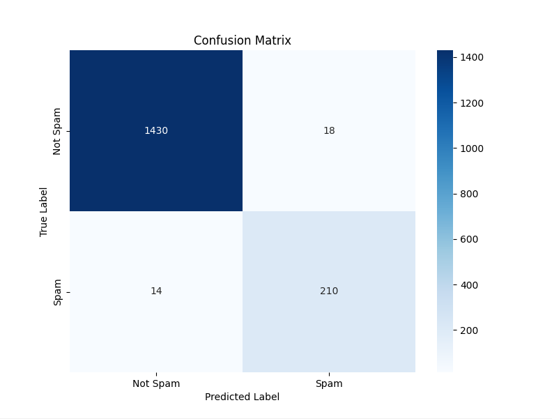

# SMS Spam Detection Application

## Overview
The SMS Spam Detection Application is a command-line interface (CLI) tool that classifies SMS messages as "Spam" or "Not Spam" using a trained machine learning model. This project leverages Python and Scikit-learn for training and prediction.

## Features
1. Train a spam detection model using the provided dataset.
2. Classify user-input SMS messages as spam or not.
3. Visualize model performance using confusion matrices and classification reports.
4. Automatically handles missing model or vectorizer files by retraining.

## How It Works
1. **Text Preprocessing**:
   - The raw SMS data is preprocessed using **CountVectorizer**, which converts the text into a numerical Bag-of-Words representation.
   - The vectorizer is saved as `vectorizer.pkl` for consistent text transformation during predictions.

2. **Model Training**:
   - The application uses **Multinomial Naive Bayes**, a popular algorithm for text classification tasks.
   - Model training includes splitting the dataset into training and test sets to evaluate performance.
   - The trained model is saved as `spam_classifier_model.pkl`.

3. **Prediction Pipeline**:
   - User-input messages are transformed using the saved `vectorizer.pkl`.
   - The transformed input is passed to the `spam_classifier_model.pkl` for classification.

## File Details
### `vectorizer.pkl`
- **Purpose**: Stores the trained `CountVectorizer` object, which is responsible for converting raw text messages into numerical feature vectors.
- **What It Does**:
  - Learns the vocabulary from the training dataset.
  - Ensures consistency in text preprocessing during both training and prediction phases.
- **Importance**:
  - Without this file, the model cannot process raw text into a format it understands.

### `spam_classifier_model.pkl`
- **Purpose**: Stores the trained **Multinomial Naive Bayes** model.
- **What It Does**:
  - Predicts whether an input message is spam or not based on the features created by `vectorizer.pkl`.
- **Importance**:
  - Handles the actual classification task. Without this file, predictions cannot be made.

## Training Data
- **Dataset**: The SMS Spam Collection dataset, consisting of labeled SMS messages.
- **Labels**:
  - `ham`: Not Spam (renamed to "Not Spam" for clarity).
  - `spam`: Spam.
- **Size**: The dataset includes approximately 5,572 messages.

### Dataset Details:
- Total messages: 5,572
- Labels: "ham" (Not Spam) and "spam" (Spam).

The dataset is preprocessed by:
1. Mapping labels to "Not Spam" and "Spam."


## Model Performance
- **Accuracy**: ~98% on the test dataset.
- **Classification Report**:
```
               precision    recall  f1-score   support

    Not Spam       0.99      0.99      0.99      1448
        Spam       0.92      0.94      0.93       224

    accuracy                           0.98      1672
   macro avg       0.96      0.96      0.96      1672
weighted avg       0.98      0.98      0.98      1672
```
- **Confusion Matirx**



## Algorithms Used
The application leverages the **Multinomial Naive Bayes (MNB)** algorithm, which is particularly suited for text classification tasks due to its simplicity and efficiency.

### Why Multinomial Naive Bayes?
- **Text-based suitability**: MNB is highly effective for bag-of-words models.
- **Speed**: Ideal for real-time predictions.
- **Accuracy**: Provides competitive results for spam detection.

## Model Performance
On testing with the SMS Spam Collection dataset, the model achieved:
- **Accuracy**: 98%
- **Precision (Spam)**: 92%
- **Recall (Spam)**: 94%
- **F1-Score (Spam)**: 93%

### Visual Performance Analysis
The application generates a **confusion matrix heatmap**, allowing users to visualize:
- True Positives
- True Negatives
- False Positives
- False Negatives

## How to Use
1. install requirements 
   ```bash
   pip install -r requirements.txt
   ```
2. Run the application:
   ```bash
   python sms_spam_detection.py
   ```
5. Choose from the following options:
   - **1**: Train the model.
   - **2**: Classify a message.
   - **3**: Exit.

### Example Usage
#### Training the Model
```plaintext
Enter your choice (1/2/3): 1
Model Performance:
Accuracy: 0.98
Classification Report:
               precision    recall  f1-score   support

    Not Spam       0.99      0.99      0.99      1448
        Spam       0.92      0.94      0.93       224

   accuracy                           0.98      1672
  macro avg       0.96      0.96      0.96      1672
weighted avg       0.98      0.98      0.98      1672
```

#### Predicting a Message
```plaintext
Enter your choice (1/2/3): 2
Enter a message to classify (or type 'exit' to quit): Where are you now?

================ Result ================
Message: Where are you now?
Classification: Not Spam
=======================================
```

## Improvements and Future Training
1. **Dataset Enhancement**:
   - Use larger, diverse datasets to improve generalization.
   - Incorporate multilingual datasets for wider applicability.

2. **Algorithm Upgrades**:
   - Experiment with other machine learning models like Support Vector Machines (SVM) or Logistic Regression.
   - Use advanced techniques like Recurrent Neural Networks (RNNs) for sequence-based learning.

3. **Hyperparameter Tuning**:
   - Optimize Naive Bayes parameters for better performance.

4. **Additional Features**:
   - Develop a GUI-based interface for user convenience.
   - Add functionality for users to upload and classify multiple messages in bulk.

## Conclusion
This application provides a robust and user-friendly solution for detecting spam messages. With high accuracy and a clear CLI interface, it serves as an excellent starting point for further exploration in spam detection and natural language processing.

